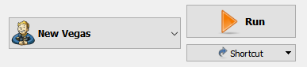

[<< Back to Readme](readme.md)  
[<< Back to Setup](setup.md)

> PROTIP: Click on the list icon on the upper left corner of this document to see the index for this guide.

# NEW VEGAS S#ARP

## PREAMBLE

### Disclaimer

This guide is the second step in the installation of **New Vegas Sharp**. Please make sure to follow the [**Setup**](setup.md) section before proceeding.

### Creating a separator

Separators allow you to neatly separate installed mods in Mod Organizer 2 for ease of viewing. These can be created and then moved around in the left pane to place them where you want them to be. Separators can also be collapsed to keep your mod list clean and tidy. I suggest creating a separator for each mod category we will be installing (category names are highlighted in CAPS).

To create a separator, follow these stpes:

- Right click on the empty space on the left pane, below **Overwrite**, and click **Create Separator**.
- Name your separator and click **OK**.

### Installing mods in Mod Organizer 2

In part one of the guide, we installed mods manually, outside **Mod Organizer 2**. In part two, the vast majority of mods will be installed through our mod manager.

- To install mods that were downloaded manually, be it from **Nexus** or from other sources lacking a mod manager download option, click the  button in Mod Organizer 2. Browse to the location of the downloaded file, and double-click on it to add it to MO2. On the left pane, click the empty checkbox next to the mod to activate it.
- To install mods downloaded through your mod manager, click the **Downloads** tab on the right pane of Mod Organizer 2. Right-click the downloaded mod, and select **Install**. On the left pane, click the empty checkbox next to the mod to activate it.

> ℹ️ By default, use the name provided by Mod Organizer 2 when installing a mod, unless stated otherwise. These names are required for the last step in our installation (that of sorting mods according to a provided text file) to work correctly.

## xNVSE PLUGINS

### Essential plugins

[**NVAC - New Vegas Anti Crash**](https://www.nexusmods.com/newvegas/mods/53635)  
Implements structured exception handling and sanity checking to reduce frequency of game crashes.

[**NVTF - New Vegas Tick Fix**](https://www.nexusmods.com/newvegas/mods/66537)  
Fixes the tick count bug (which creates noticable micro stutter), optimizes hash tables (helping performance and decreasing menu load times), and fixes the high FPS bug (fixing physics and lipsync at high framerates).

[**FNV Mod Limit Fix**](https://www.nexusmods.com/newvegas/mods/68714)  
Allows a maximum of 255 plugins to be loaded, as well as improving FPS, removing game stutter, and allowing for faster loading times (particularly when using a large number of mods).

[**OneTweak**](https://github.com/Sigourn/newvegassharp/raw/main/mods/OneTweak%202.1.0.2.7z)  
Enables borderless window mode for safe alt-tabbing.
- After installation, click the **Tools**  button, and click **INI Editor**. Select the **FalloutCustom.ini** tab.
- Set **bFull Screen** to 0.
- Click **Save** and close the window.

[**Improved Lighting Shaders**](https://www.nexusmods.com/newvegas/mods/69833)  
Almost completely fixes the exterior lighting bug, and allows up to four times the number of active lights.

### Expanded mod support

[**JIP LN NVSE Plugin**](https://www.nexusmods.com/newvegas/mods/58277)  
Adds new functions, engine bug fixes and tweaks, and restored broken game features.
- After installation, double-click the mod and select the **INI Files** tab.
- Select **jip_nvse.ini**, and set **bEnableFO3Repair** to 1.
- Click the **Save** icon and close the window.

> ℹ️ This caps how much an item can be repaired based on the player's Repair skill.

[**JohnnyGuitar NVSE**](https://www.nexusmods.com/newvegas/mods/66927)  
Adds new functions, engine bug fixes and tweaks, and restored broken game features.

[**kNVSE Animation Plugin**](https://www.nexusmods.com/newvegas/mods/71336)  
Enables having custom animations for weapons and actors. Also fixes the engine-bound anim group limit problem.

[**ShowOff NVSE Plugin**](https://www.nexusmods.com/newvegas/mods/72541)  
Adds new functions, engine bug fixes and tweaks.
- Install **ShowOff NVSE** (Main files).
- Install **ShowOff INI** (Main files). Merge when prompted.

[**UIO - User Interface Organizer**](https://www.nexusmods.com/newvegas/mods/57174)  
An NVSE-powered plugin designed to manage and maintain all UI/HUD extensions added to the game by various mods.

[**yUI - User Ynterface**](https://www.nexusmods.com/newvegas/mods/74357)  
Aims to fix UI bugs and add new UI features. 
- After installation, double-click the mod and select the **INI Files** tab.
- Select **yUI.ini**, and set **bMatchingCursor** to 1.
- Click the **Save** icon and close the window.

> ℹ️ This matches the in-game cursor to the current HUD color, required for **Simple Cursor (YUI)** which we will install in the **User Interface** section.

## PATCHES

### General fixes

[**Ultimate Edition ESM Fixes**](https://www.nexusmods.com/newvegas/mods/77170)  
Optimizes and cleans the esms, as well as fixes some hard errors in the landscape. Boosts performance on modern systems with SSDs.
- Manually download **Ultimate Edition ESM Fixes** (Main files).
- Extract the contents of the archive.
- Run **Installer.exe**.
- Under the **ESM Fixes** header, navigate to **C:\Games\Fallout New Vegas Mods\MO2\mods**. Create an empty folder named **Ultimate Edition ESM Fixes**. Select the folder.
- Click **INSTALL**. **EXIT** the program once the process is finished.
- In Mod Organizer 2, press **F5** to refresh the window. Activate the **Ultimate Edition ESM Fixes** mod.

[**Yukichigai Unofficial Patch - YUP**](https://www.nexusmods.com/newvegas/mods/51664)  
Collection of bug fixes for Fallout: New Vegas and its DLCs, combined into one ESM.
- Install **YUP - Base Game and All DLC** (Main files).

[**Landscape Disposition Fix**](https://www.nexusmods.com/newvegas/mods/73937/)  
Small mod fixing several hundred vanilla floating objects, underground or above ground.

[**Navmesh Fixes and Improvements**](https://www.nexusmods.com/newvegas/mods/62041)  
Fixes virtually every navmesh where the edge connections were missing or pointing at misplaced or invalid triangles. Also makes improvements to the majority of the affected navmeshes.
- Install **Navmesh Fixes and Improvements - Base Game and ALL DLC** (Main files).

[**Strip Performance Fix**](https://www.nexusmods.com/newvegas/mods/78617)  
Drastically improves performance on The Strip by getting rid of water LOD.

[**The Strip NPCs Uncut - Content Restoration**](https://www.nexusmods.com/newvegas/mods/71503)  
Restores some cut but fully-functional NPCs to the Strip, increasing the Strip's population by 32.

[**Uncut Wasteland**](https://www.nexusmods.com/newvegas/mods/56625)  
Restores a huge amount of cut content from the game, from scenery and little random things, to NPCs and creatures.
- Install **Uncut Wasteland plus NPCs** (Main files).
- Install **Uncut Wasteland Pole Remover** (Optional files). Merge when prompted.

[**Uncut Wasteland Tweaks**](https://github.com/Sigourn/newvegassharp/raw/main/mods/Uncut%20Wasteland%20Tweaks.7z)  
Includes YUP fixes, omits NPC restorations at the Ultra-Luxe Bathhouse, and replaces static Destitute Travelers with leveled, random NPCs.

[**Strip Lights Region Fix**](https://www.nexusmods.com/newvegas/mods/73596?)  
Fixes a vanilla issue about the Strip lights not showing in certain parts of the map.
- Install **Strip Lights Region Fix** (Main files).
- Install **Strip Lights Region Fix - Uncut Wasteland** (Optional files). Merge when prompted.

### Mesh fixes

[**Armor and Clothing First Person Clipping Fixes**](https://github.com/Sigourn/newvegassharp/raw/main/mods/Armor%20and%20Clothing%20First%20Person%20Clipping%20Fixes.7z)  
Addresses first-person clipping for a variety of outfits, particularly noticeable when moving with a weapon drawn.

[**New Vegas Mesh Improvement Mod - NVMIM**](https://www.nexusmods.com/newvegas/mods/74295)  
Optimizations and fixes for a large selection of meshes in the base game and DLCs.

[**Fix for the Caesar Legion Armors YUPdated**](https://github.com/Sigourn/newvegassharp/raw/main/mods/Fix%20for%20the%20Caesar%20Legion%20Armors%20YUPdated.7z)  
Fixes numerous issues with the Caesar Legion armor meshes, and flags the helmets appropriately so you can no longer equip inadequate headgear along with them.

> ℹ️ [**Link**](https://www.nexusmods.com/newvegas/mods/65004) to original mod by **YanL**. The featured version includes YUP fixes and omits unnecessary edits.

[**Throwable Weapon Fixes**](https://www.nexusmods.com/newvegas/mods/62767)  
Collection of visual and audio fixes to throwable weapons, including all types of throwable explosive devices, throwable knives, hatchets, tomahawks, inversal/proton axes, and more.

[**ISControl Enabler and Ironsights Adjuster (now ESPless)**](https://www.nexusmods.com/newvegas/mods/75417)  
Dynamically adds ISControl node system animation support plus easy per-weapon sights adjustment.

[**Vanilla Iron Sights Realligned**](https://www.nexusmods.com/newvegas/mods/77672)  
Fixes all the iron sights on vanilla weapon meshes using ISControl Enabler. No meshes and no ESP.

### Audio fixes

[**Elijah Voice Audio Files Fix**](https://www.nexusmods.com/newvegas/mods/73526)  
Fixes Elijah's voice loudness and clipping issues in Dead Money. 
- Install **Elijah Voice Files Fix - WAV Encoding** (Main files).

[**High-Quality Classic Music**](https://www.nexusmods.com/newvegas/mods/72150)  
Replaces the low-quality soundtrack from the classic Fallout games with high-quality versions.

### NVSE fixes

[**Unofficial Patch NVSE Plus**](https://www.nexusmods.com/newvegas/mods/71239?)  
Collection of bug fixes for Fallout: New Vegas and its DLCs which require NVSE.

[**Climate Control NVSE**](https://www.nexusmods.com/newvegas/mods/77205)  
NVSE plugin which fixes bugs and adds utilities for weather mods.
- Install **Climate Control NVSE** (Main files).
- Install **Longer Weather Transitions** (Optional files). Merge when prompted.

[**High Resolution Bloom NVSE**](https://www.nexusmods.com/newvegas/mods/77933)  
Allows for customizable bloom resolution, making it possible to use resolutions other than vanilla's quarter one.

[**High Resolution Water Fog**](https://www.nexusmods.com/newvegas/mods/78400)  
Increases resolution of water depth render target, thus significantly reducing aliasing.

[**Melee VATS Animation Restoration**](https://www.nexusmods.com/newvegas/mods/73480)  
Brings back the VATS melee animations from Fallout 3.

[**MoonlightNVSE**](https://www.nexusmods.com/newvegas/mods/77683)  
Fixes moonlight, making the moon the light caster instead of the sun.

[**Pip-Boy Shading Fix NVSE**](https://www.nexusmods.com/newvegas/mods/77957)  
Fixes the Pip-Boy's shading, making it not ignore lights around it.

[**lStewieAl's Tweaks and Engine Fixes**](https://www.nexusmods.com/newvegas/mods/66347)  
Engine bugfixes, optional tweaks and new features with no performance impact. Fully customisable via in-game menu and INIs.

[**Stewie Tweaks Custom INI**](https://github.com/Sigourn/newvegassharp/raw/main/mods/Stewie%20Tweaks%20Custom%20INI.7z)  
Enables essential bugfix and quality-of-life settings, hand-picked by lStewieAl, as well as a number of gameplay tweaks. Based off [**Stewie Tweaks Essentials INI**](https://www.nexusmods.com/newvegas/mods/76522).

<details>
<summary>Enabled gameplay tweaks</summary>

```
; allows scroll-wheel to zoom while using a scope
bAdjustableScopeZoom = 1
; only allow zooming with binoculars
bBinocularsOnly = 1
; prevents firing if you don't have enough ammo for one burst
bClipSizeMatters = 1
; holding the attack button for grenades decreases their detonation timer
bCookableGrenades = 1
; change ammo types when reload is pressed twice in quick succession
bDoubleTapReloadToChangeAmmoType = 1
; allow hold/releasing for throwables similar to grenades
bHoldAndReleaseThrowables = 1
; makes sneaking holdable rather than toggleable
bHoldCrouchToSneak = 1
; stop the player's automatic reloading when the clip is emptied
bManualReload = 1
; don't allow exiting the hacking menu if an attempt has been made
bNoExitHacking = 1
; disallows grabbing of owned items
bNoGrabOwnedItems = 1
; remove the skill requirement prefix from dialog topics
bNoSkillTags = 1
; setting: 0 keeps the entire skill tag, 1 removes the tag, and 2 keeps the skill but not the number, i.e. [Speech]
iRemoveTags = 2
; adds hotkeys 0-9 to select options in the dialog menu (recommended use with VUI+'s numbered topics setting)
bNumberedDialogHotkeys = 1
; alters the pickpocket formula to take into account item weight, target perception and detection value
bPickpocketOverhaul = 1
; place caps in merchant containers instead of their inventory when using repair services
bPreventStealingCapsAfterRepair = 1
; add hotkeys to instantly equip the cross-hair and container selections
bQuickUse = 1
; restore the '2' weapon hotkey
bRestore2Hotkey = 1
; add a button to sort/filter the inventory
bShowInventorySortButton = 1
; open the PipBoy world map
iOpenMapKey = 50
; open the PipBoy quests tab
iOpenQuestsKey = 36
[GameSettings]
; mirrors Action Camera
fOverShoulderPosZ = 1.0
fOverShoulderPosX = 28.0
fOverShoulderRotMult = 0.3
```
</details>

## USER INTERFACE

[**The Mod Configuration Menu**](https://www.nexusmods.com/newvegas/mods/42507)  
Allows any number of mods to be configured from a single menu, accessible through the Pause menu.
- Install **The Mod Configuration Menu** (Main files).
- Install **MCM BugFix 2** (Update files). Merge when prompted.

[**Vanilla UI Plus (New Vegas)**](https://www.moddb.com/mods/vanilla-ui-plus/downloads/vanilla-ui-plus-nv)  
Greatly improves the user interface without compromising the original style.
- Download the mod using the **DOWNLOAD NOW!** button.
- Check the following options in the FOMOD installer:
  - [X] Classic Pip-Boy Font
  - [X] Plugin
  - [X] WASD Compatible 

> ℹ️ The **Classic Pip-Boy Font** option includes the **Default Font Tweaks** option, and only enables said font exclusively in the Pip-Boy screen.

- After installation, double-click the mod and select the **Filetree** tab.
- Expand the **Menus\Prefabs\VUI+** folder, and double-click **settings.xml**.
- Set **VUI+DialogMaxHeight** to 276.
- Set **VUI+NumberedTopics** to 1.
- Save and close the file.

> ℹ️ This increases the amount of visible dialogue options and enables numbered dialogue options.

[**Clean Vanilla HUD**](https://www.nexusmods.com/newvegas/mods/70001)  
Cleans up HUD textures (such as the compass ticks or other arrows) that have went unnoticed.
- Stick to the default options in the FOMOD installer.

[**Clean Companion Wheel**](https://www.nexusmods.com/newvegas/mods/70486)  
Cleans up the Companion Wheel textures.
- Install **Clean Companion Wheel 256x256 Edition** (Main files).

[**Clean Vault Boy Paper Doll**](https://www.nexusmods.com/newvegas/mods/76966)  
Cleans up the Vault Boy paper doll textures.

[**Consistent Pip-Boy Icons**](https://www.nexusmods.com/newvegas/mods/65046)  
Bug fixes and consistency tweaks for icons in terms of coloring and transparency.
- Install **1. Consistent Pip-boy Icons** (Main files) as **Consistent Pip-Boy Icons**. This Ukraine shit is driving me up the wall.
- Install **4. Vanilla UI Plus Patch** (Optional files). Merge when prompted.

[**Pop-Up Message Icons**](https://www.nexusmods.com/newvegas/mods/76516)  
Cleans up the Vault Boy pop up message icons.
- Stick to the default options in the FOMOD installer.

[**Simple Cursor YUI**](https://www.nexusmods.com/newvegas/mods/78340)  
A simple and clean cursor replacer to be used with yUI and matching Clean Vanilla HUD's visual design.
- Install **Simple Cursor (SMALL)** (Main files).

[**High Res Local Maps**](https://www.nexusmods.com/newvegas/mods/77963)  
Increases the resolution of local maps from 128 to 512, optionally you can change it to 256 or 1024.

[**High Resolution Screens**](https://www.nexusmods.com/newvegas/mods/77989)  
Increases the render resolution of in-game screens to match game's screen resolution. 

[**Satellite World Map**](https://www.nexusmods.com/newvegas/mods/58602)  
High-res satellite map for the Mojave Wasteland.
- Install **Satellite World Map** (Main files).

[**Satellite Maps DLC**](https://www.nexusmods.com/newvegas/mods/64292)  
High-res satellite maps for Dead Money, Honest Hearts, Old World Blues, and Lonesome Road.

[**FOV Slider**](https://www.nexusmods.com/newvegas/mods/55085)  
Adds an MCM menu that allows for adjusting the Fields of View for all of the game's camera views.

## QOL IMPROVEMENTS

[**Console Paste Support**](https://www.nexusmods.com/newvegas/mods/65906)  
Enables hotkeys for pasting and enhanced movement/deletion of console commands.

[**Delay DLC Redux**](https://www.nexusmods.com/newvegas/mods/75851)  
Prevents the game's DLC from spamming the new game startup messages and requires you be near a given DLC's starting location to receive its quest, in addition to requiring the player to listen to the respective DLC's radio broadcast before the quest will start.
- Install **Delay DLC Redux** (Main files).

[**Essential Vanilla Enhancements Merged**](https://www.nexusmods.com/newvegas/mods/78877)  
A collection of small vanilla-friendly gameplay improvements that have been fully merged, updated, and cleaned.

[**Essential DLC Enhancements Merged**](https://www.nexusmods.com/newvegas/mods/73803)  
A collection of small essential gameplay improvements for the official DLCs that have been fully merged, updated, and cleaned.
- Install **Vanilla Enhancements Merged** (Main files).
- Install **Vanilla Enhancements Merged - JSawyer Ultimate Push's Tweaks Patch** (Optional files). Merge when prompted.

[**Shut Up DLC Companions YUPdated**](https://github.com/Sigourn/newvegassharp/raw/main/mods/Shut%20Up%20DLC%20Companions%20YUPdated.7z)  
Stops the companions from Dead Money and Honest Hearts from constantly saying all sorts of idle chatter.

> ℹ️ [**Link**](https://www.nexusmods.com/newvegas/mods/63082) to original mod by **ZuTheSkunk**. The featured version includes YUP fixes.

[**Misc Immersion Merge**](https://www.nexusmods.com/newvegas/mods/75283)  
Compilation of minor visual and gameplay mods intended for a more immersive experience.

[**Better Character Creation**](https://www.nexusmods.com/newvegas/mods/70973)  
Improves the character creation by speeding up the process, adding specialized gear based on your tag skills, and making Wild Wasteland an opt-in feature rather than a trait.

[**Faster Pip-Boy Animation**](https://www.nexusmods.com/newvegas/mods/67761)  
Increases the speed of the Pip-Boy animation.
- Install **Faster Pip-Boy Animation (2x)** (Main files).

[**Follower Tweaks**](https://www.nexusmods.com/newvegas/mods/62180)  
Removes annoying features from some followers. Changes the effects of the Enhanced Sensors, Spotter, and Search and Mark perks. ED-Es no longer 'whirs' whilst moving.

[**Immersive Primary Needs**](https://eddoursul.win/download/228)  
As hunger, thirst or sleep deprivation increase, the player is notified by periodic sound effects. These effects kick in shortly before the first penalties occur, so the player is given a chance to eat, drink or sleep in time.
- Install as **Immersive Primary Needs**.

[**Melee Reach Fixed YUPdated**](https://github.com/Sigourn/newvegassharp/raw/main/mods/Melee%20Reach%20Fixed%20YUPdated.7z)  
Fixes the horribly inconsistent vanilla weapon reach for melee weapons.

> ℹ️ [**Link**](https://www.nexusmods.com/newvegas/mods/57729?) to original mod by **naugrim04**. The featured version omits outdated fixes.

## VISUALS

[**Anniversary Anim Pack**](https://www.nexusmods.com/newvegas/mods/70158)  
Merge of many animation mods by the same author, improving the game's overall look and feel when it comes to gunplay.

[**Anniversary Anim Pack - General Bugfix**](https://www.nexusmods.com/newvegas/mods/72320)  
Fixes camera jumps, animation snapping, movement lock, and broken aim in 3rd person when using Anniversary Anim Pack.
- Install **AnniAnimPack_BugFix 1.3** (Main files).
- Install **Bonus Patch** (Main files). Merge when prompted.

[**FNV Clean Animations**](https://www.nexusmods.com/newvegas/mods/70599)  
Clean first person animations. No new idles, no bugs, no reload cancelling from shooting early or crouching, no compatibility issues.
- Install **FNV Clean Animations** (Main files).
- Install **FNV Clean Animations - Update 2.2.2** (Update files). Merge when prompted.

[**Viewmodel Recoil 0.308**](https://www.nexusmods.com/newvegas/mods/71852)  
Adds a visual recoil mod that affects first person model only and doesn't move the camera at all.

[**B42 Weapon Inertia**](https://www.nexusmods.com/newvegas/mods/64335)  
Adds weapon inertia, causing weapons to slightly lag behind camera movement to give a feeling of weight to them.

[**Diagonal Movement**](https://www.nexusmods.com/newvegas/mods/64333)  
Adds diagonal movement.

[**NV Compatibility Skeleton**](https://www.nexusmods.com/newvegas/mods/68776)  
A compatible skeleton for many animation mods.
- Check the following option in the FOMOD installer:
  - [X] Vanilla Weights

[**Different Pip-Boy Animations**](https://www.nexusmods.com/newvegas/mods/75420)  
Detail-focused animation, meant to look natural and immersive. Takes just a little longer to access the Pip-Boy but has detail in the animation itself with more "inertia".
- Install **Female Anim B** (Main files).
- Install **Male Anim B** (Main files). Merge when prompted.

[**Hit - Locomotion**](https://www.nexusmods.com/newvegas/mods/76097)  
Improved movement animations with subtle headbob, inertia and leaning.

[**Character Expansions Revised**](https://www.nexusmods.com/newvegas/mods/64862)  
Visual overhaul of characters' faces, following vanilla aesthetics. 

[**Character Expansions Revised - FaceGen Tint Fix**](https://www.nexusmods.com/newvegas/mods/75268)  
Fixes colored tints on character faces. Visual comparison [**available here**](https://imgsli.com/ODY2MzE).
- Install as **Character Expansions Revised - FaceGen Tint Fix**.

[**Eyelashes New Vegas**](https://www.nexusmods.com/newvegas/mods/34790)  
Adds animated eyelashes to NPCs and the player character.
- Install **tkEyelashesFNV** (Main files).
- After installation, double-click the mod and select the **Filetree** tab.
- Right-click **tkEyelashesFNV_FemalesOnly.esp**, and click **Hide**.
- Close the window.

[**Eyelashes New Vegas ESP Replacer**](https://www.nexusmods.com/newvegas/mods/75268)  
Fixes issues with the plugin, and extends support to Honest Hearts' tribals and Dead Money's Christine.
- Install as **Eyelashes New Vegas ESP Replacer**.

[**HD Teeth and Natural Eyelashes and Eyebrows**](https://www.nexusmods.com/newvegas/mods/53695)  
Improves teeth, eyelashes, and eyebrow textures.
- Install **Eyelashes 1.3** (Main files).
- Install **HD teeth 3.0** (Main files). Merge when prompted.
- Install **HQ eyebrows** (Main files). Merge when prompted.

[**Natural Eyes**](https://www.nexusmods.com/newvegas/mods/62811)  
Improves eye textures.
- Install **00 - Natural Eyes - Shadow** (Main files).

[**Vanilla Hair - No Shine**](https://www.nexusmods.com/newvegas/mods/50285)  
Removes shine from vanilla hairs.

[**No More Pip-Boy Glove**](https://www.nexusmods.com/newvegas/mods/69258)  
Removes the Pip-Boy glove from the player and NPCs.
- Install **No More Pip-Boy Glove (No Plugin)** (Main files).

[**Pip-Boy 2000 Mk VI**](https://www.nexusmods.com/newvegas/mods/65980)  
New Pip-Boy 2000 Mk VI with custom scratch-made meshes, textures and working clock like in Fallout 76.
- Install **Pip-Boy 2000 Mk VI replacer version** (Main files).
- Install **Working date and clock for replacer** (Optional files). Merge when prompted.

[**Pip-Boy 2000 MK VI (Wasteland Edition) Retexture**](https://www.nexusmods.com/newvegas/mods/65999)  
A grittier retexture for the Pip-Boy 2000 Mk VI.

[**Pip-Boy 2000 Mk VI Working Buttons**](https://www.nexusmods.com/newvegas/mods/75268)  
Makes the Pip-Boy 2000 Mk VI's buttons fully functional. Requires the original mod to be installed.
- Install as **Pip-Boy 2000 Mk VI Working Buttons**.

[**NPC Arm Mounted Pip-Boy 2000 Mk VI**](https://www.nexusmods.com/newvegas/mods/75268)  
Makes NPCs wear the new Pip-Boy 2000 Mk VI. Requires the original mod to be installed.
- Install as **NPC Arm Mounted Pip-Boy 2000 Mk VI**.

[**Vanilla Underwear Replacer**](https://www.nexusmods.com/newvegas/mods/64006?)  
A simple replacer for the default underwear, removing the shirt for males and tweaking the shape of the female top.

[**A Little More Lamplight**](https://www.nexusmods.com/newvegas/mods/69226)  
Enhances the shoddy work on the vanilla functional streetlamps and lights of Outer Vegas, Camp McCarran, Camp Golf, and the NCRCF. 

[**Strip Lighting Overhaul**](https://www.nexusmods.com/newvegas/mods/73324)  
Adds lights to the Strip where lights existed but where not producing light. Also fixes a number of vanilla bugs via editing the environment and certain meshes.

[**Wasteland Grass Overhaul**](https://github.com/Sigourn/newvegassharp/raw/main/mods/Wasteland%20Grass%20Overhaul.7z)  
Improves grass textures.

> ℹ️ [**Link**](https://www.nexusmods.com/newvegas/mods/39856) to original mod by **vurt**. The featured version omits non-grass related meshes and textures.

[**Desert Natural Weathers - NV - TTW**](https://www.nexusmods.com/newvegas/mods/75437)  
An overhaul of the weathers in New Vegas with 360 panoramic cloud textures, improved lighting, and DLC support.
- Install **Desert Natural Weathers NV** (Main files).
- Install **Alternate Atmosphere Mesh from RWLE** (Optional files). Merge when prompted.
- After installation, double-click the mod and select the **INI Files** tab.
- Select **HDRWeatherAndColor.ini**, and set **bInteriorColorFix** to 0.
- Click the **Save** icon and close the window.

> ℹ️ This restores the vanilla interior color tint, which in my opinion is rather atmospheric.

[**Accurate NASA Stars**](https://www.nexusmods.com/newvegas/mods/75522)  
New star texture and mesh using NASA satellite images to create a real-world accurate starfield for New Vegas.
- Install **Accurate Stars 4k** (Main files).

> ℹ️ This mod is a fitting companion to the **HD Moon 2K - NASA Satellite Images** mod included in Desert Natural Weathers.

[**Night Sky Tweaks**](https://www.nexusmods.com/newvegas/mods/73529)  
Fixes the bright night sky horizons.
- Install **Night Sky Tweaks (No Plugin)** (Main files).

[**Improved LOD Noise Texture**](https://www.nexusmods.com/newvegas/mods/46451)  
Vastly improves the LOD noise texture used on distant land.
- Install **Improved LOD noise Texture** (Main files).

[**HD Mist**](https://www.nexusmods.com/newvegas/mods/58955)  
High resolution retexture for mist.
- Install **HD Mist 2K** (Main files).

[**ENB Friendlier HD Dust Storms**](https://www.nexusmods.com/newvegas/mods/64085)  
HD retexture of dust storms. Non-ENB version available.
- Install **3. Non-ENB HD Dust Storms - 2048** (Optional files).

[**More Subtle Hidden Valley Dust Storm**](https://www.nexusmods.com/newvegas/mods/70275)  
Tones down the dust storm effect near the Hidden Valley bunkers.

[**More Subtle New Vegas Light Pollution**](https://www.nexusmods.com/newvegas/mods/73579)  
Reduces the distant glow of New Vegas for the sake of darker nights.
- Install **Slightly Brighter** (Main files).

## GAMEPLAY

[**B42 Melee Bash**](https://www.nexusmods.com/newvegas/mods/68055)  
Adds melee attacks for non-melee weapons, similar to melee hits and buttstrokes in modern FPS games.

[**Charisma Matters**](https://www.nexusmods.com/newvegas/mods/78448)  
Makes Charisma scale the amount of Reputation received when helping or harming a faction. High Charisma will make it easier to become liked and harder to be hated, whereas low Charisma will make it harder to become liked and easier to be hated.

[**Follower Formula Redone**](https://www.nexusmods.com/newvegas/mods/71490)  
Changes the amount of followers for you can have to your Charisma stat/2, rounded down (configurable).

[**Immersive Recoil**](https://www.nexusmods.com/newvegas/mods/61973)  
Adds recoil animations to player and NPCs. Recoil strength is calculated based on weapon base damage, requirements, condition and weight, and the character's skill and strength. Aiming down sights and crouching also reduces recoil.

[**Improved Traits**](https://www.nexusmods.com/newvegas/mods/65403)  
Overhauls the vanilla traits to effectively remove all SPECIAL buffs and debuffs, replacing them with effects that simulate what was replaced, as well as adds 2 new traits.

[**Just Assorted Mods**](https://www.nexusmods.com/newvegas/mods/66666)  
A collection of toggleable mods, including dynamic crosshair, hit marker, hit indicator, visual objectives, hold breath, vanilla sprint, bullet time, weapon wheel, and loot menu.

> ℹ️ For detailed instructions on how the **Weapon Wheel** feature works, check out the [**Just Weapon Wheel**](https://www.nexusmods.com/newvegas/mods/67460) page.

[**Just Sprint Animation Replacers**](https://www.nexusmods.com/newvegas/mods/74839)  
Improves animation transitions when going from idle to sprint, plus allows the player to reload their weapons when sprinting.

[**Clean Just Weapons Wheel**](https://www.nexusmods.com/newvegas/mods/76357)  
Cleans up the Just Weapons Wheel textures.

[**NPCs Sprint In Combat**](https://www.nexusmods.com/newvegas/mods/68179)  
NPCs will now sprint in melee combat instead of casually jogging. Uses custom sprint animations.

[**Laser Weapon Iron Sights**](https://www.nexusmods.com/newvegas/mods/70790)  
Adds iron sights to numerous Energy Weapons that were lacking them.
- Install **Laser Weapon Iron Sights - Gun Runner's Arsenal Merged** (Main files).
- Install **Plasma Weapon Iron Sights - Gun Runner's Arsenal Merged** (Main files). Merge when prompted.
- Install **Laser Weapon Iron Sights - Iron Sight Recoil Animations** (Optional files). Merge when prompted.
- Install **Plasma Weapon Iron Sights - Iron Sight Recoil Animations** (Optional files). Merge when prompted.

[**Melee Cleave**](https://www.nexusmods.com/newvegas/mods/66187)  
Makes melee attacks hit multiple enemies for a more satisfying melee gameplay.

[**NPCs Use Aid Items**](https://www.nexusmods.com/newvegas/mods/68742)  
NPCs will now "use" Stimpacks and other aid items to recover health and buff their stats. The chems they use are based on if they are carrying them or if they will drop them on death.

[**Passive Combat Music Tweaked**](https://www.nexusmods.com/newvegas/mods/69424)  
Combat music will only start when the player or an enemy start combat with each other.
- Install **New and Improved** (Main files).

[**Player Combat Priority**](https://www.nexusmods.com/newvegas/mods/71699)  
Prevents the game becoming too easy by making enemies more likely to target the player in combat rather than companions.

[**Progressive Sneak Attack Damage**](https://www.nexusmods.com/newvegas/mods/77571)  
Makes sneak attack critical damage scale with the player's Sneak skill.

[**RAD - Radiation (is) Actually Dangerous - Overhaul**](https://www.nexusmods.com/newvegas/mods/71541)  
Causes radiation to damage your health until it is removed. Every 10 points of radiation reduces your maximum health by 1%. With Hardcore mode enabled, your primary needs will reduce your AP as well.

[**Realistic Movement**](https://www.nexusmods.com/newvegas/mods/64202)  
Movement is slowed for all actors, and their turning speed is also reduced, forcing them to make parabolic turns instead of sharp ones. Movement speed is especially slower for actors who have their weapon out. This makes combat targets less likely to dodge your bullets while strafing.

[**Reload Reloaded**](https://www.nexusmods.com/newvegas/mods/62266)  
Replacements for agility modifiers to reload and draw speed, strength modifiers to throwing range, and custom sneak attack damage multipliers.

[**Simple Explosive Entry**](https://www.nexusmods.com/newvegas/mods/66992)  
Allows you to bypass locks with explosives, as long as your Explosives skill matches or exceeds the difficulty of the lock. Equip an explosive, crouch, then activate the locked door or chest as normal, and select Explosive Entry. Includes optional item destruction.

## JSAWYER ULTIMATE

[**JSawyer Ultimate Edition**](https://www.nexusmods.com/newvegas/mods/61592)  
JSawyer's popular mod, fully re-implemented from the ground up. Compatibility has been greatly improved, errors have been fixed, and balance corrections have been expanded - all whilst trying to maintain the original mod's vision.
- Install **JSawyer Ultimate Edition** (Main files).
- Install **JSawyer Ultimate Edition - Push's Tweaks** (Optional files). Merge when prompted.

[**Mojave Arsenal**](https://www.nexusmods.com/newvegas/mods/62941/?)  
Adds ammo variants, reloading parts, and weapon mods as loot; fixes item naming conventions; improves recipes; and adds options for configuring GRA. Compatible with mods which add new weapons and weapon mods, without the need for a patch.
- Install **Mojave Arsenal** (Main files).
- Install **Mojave Arsenal - Push's INI** (Optional files). Merge when prompted.

[**Mojave Raiders**](https://www.nexusmods.com/newvegas/mods/64660)  
Overhaul of New Vegas's raider factions, balancing their loot and adding more of them to fight.
- Install **Mojave Raiders** (Main files).
- Install **Mojave Raiders - No NPC Throwing Weapon Consumption** (Optional files). Merge when prompted.

[**JSawyer Ultimate Edition Patches**](https://www.nexusmods.com/newvegas/mods/62933)  
Patches for using several popular mods alongside JSawyer Ultimate Edition.
- Install **JSawyer Ultimate - Mojave Raiders Patch** (Main files).
- Install **JSawyer Ultimate Edition - Mojave Arsenal Patch (GRA Merged)** (Main files). Merge when prompted.

[**Mojave Wildlife**](https://www.nexusmods.com/newvegas/mods/64638)  
Adds hundreds more leveled, vanilla-friendly creature spawn points throughout the whole Mojave, based off unused vanilla leveled lists. All spawn points are meticulously hand-placed and distributed as evenly and fairly as possible.
- Install **Mojave Wildlife - Vanilla No Chanced Spawns Version** (Main files).

[**Repair Tools**](https://www.nexusmods.com/newvegas/mods/74884)  
Makes repairing more difficult by making each repair require a consumable Repair Tools item. Also replaces Weapon Repair Kits, with patches for JSawyer Ultimate's Armor Repair Kits. 
- Install **Repair Tools** (Main files).
- Install **Repair Tools - JSawyer Ultimate Push's Tweaks Patch** (Optional files).

## FINISHING TOUCHES

[**Character Expansions Revised Patches**](https://github.com/Sigourn/newvegassharp/raw/main/mods/Character%20Expansions%20Revised%20Patches.7z)  
Includes patches for **Character Expansions Revised**.
- Check the following options in the FOMOD installer:  
  - All-in-one patches
    - [X] YUP + Uncut Wasteland + SawyerBatty
  - Bonus patches
    - [X] Mojave Raiders Classic Scorpions

[**JSawyer Ultimate Patches**](https://github.com/Sigourn/newvegassharp/raw/main/mods/JSawyer%20Ultimate%20Patches.7z)  
Includes patches for **JSawyer Ultimate Edition**.
- Check the following options in the FOMOD installer:  
  - JSawyer Ultimate
    - [X] Yukichigai Unofficial Patch
    - [X] Skinned Weapon Mesh Improvement Mod - SMIM - Outfits
    - [X] Fix for the Caesar Legion Armors
    - [X] Throwable Weapon Fixes
    - [X] Improved Traits
    - [X] Miscellaneous Tweaks
    - [X] JSUE Balance Tweaks

### Adjusting mod order and load order

[**New Vegas Sharp MO2 Profile Files**](https://github.com/Sigourn/newvegassharp/raw/main/mods/New%20Vegas%20Sharp%20MO2%20Profile%20Files.7z)  
Adjusts mod order and load order for New Vegas Sharp to work as intended.
- Extract the files into **C:\Games\Fallout New Vegas Mods\MO2\profiles\New Vegas Sharp**, overwriting when prompted.

### INI config

**falloutcustom.ini (Optional)**:
- Click the **Tools**  button, and click **INI Editor**. Paste the following into **falloutcustom.ini**.

```
[Imagespace]
;Disables vanilla depth of field effect seen during dialogue.
bDoDepthOfField=0

[Interface]
;Reduces the amount of zoom when engaging in dialogue.
fDlgFocus=5.0000
;Set the Pip-Boy HUD color to match that of classic Fallout.
uPipboyColor=1022886143

[Grass]
;Increases grass density.
iMinGrassSize=40
```

## RUNNING THE GAME

From this point on, *always* use Mod Organizer 2 to run the game and to launch any tools you use. Mod Organizer 2 uses a Virtual Files folder, which is kept separate from your New Vegas installation. Failing to run the game through Mod Organizer 2 will mean the game won't register any of the installed mods.

To launch the game, make sure to have the **New Vegas** executable selected from the dropdown menu on the right pane. Then, click on the **Run** button to launch the game.



### Settings config

The following settings need to be configured after you've already started a new game, using the in-game **Settings** option.

**Gameplay**:
- Set **Killcam Mode** to None.
- Set **Difficulty** to Hard.

**Controls -> Action Mapping**:
- Set **VATS** to Esc to disable the keybinding. Using **Just Assorted Mods**, the V key will now toggle bullet time.
- Set **Ammo Swap** to Esc to disable the keybinding. Using **lStewieAl's Tweaks**, double-tap the reload key to swap ammunition.
- Set **Auto Move** to Esc to disable the keybinding. Using **B42 Melee Bash**, this key is used to attack.

### MCM config

The following settings need to be configured after you've already started a new game, using the in-game **Mod Configuration** option.

**FOV Slider**:
- Set **Player Field of View** to 55.
- Set **Pipboy Field of View** to 50.

**Just Mods**:
- Disable **Visual Objectives**.
- Disable **Hold Breath**.
- Under **Crosshair**, set **Crosshair 1st Sighting Mode** to Nothing.
- Under **Hit Indicator**, set **Self Damage Mode** and **No Attacker Mode** to Nothing.
- Under **Bullet Time**, set **Key** to V. Optionally, you can set it to your Aim button (by default, right-click) and disable toggling. This will trigger VATS whenever you aim your weapon, however, do note that this will also trigger VATS whenever you zoom in (e.g. to look at items).

**RAD**:
- Enable **Hardcore**.
- Enable **JSawyer Increments**.
- Enable **Nonscaled**.

# MOD KEYBINDINGS

Key | Function | Added by
------------ | ------------- | -------------
Q | Melee bash | B42 Melee Bash
R (double tap) | Swap ammunition | lStewieAl's Tweaks
J | Open Pip-Boy quests tab | lStewieAl's Tweaks
M | Open Pip-Boy world map tab | lStewieAl's Tweaks
Ctrl-F | Apply filter for searching in Pip-Boy | lStewieAl's Tweaks
Shift+E | Pick up and equip | lStewieAl's Tweaks
Scroll wheel | Adjust binocular zoom | lStewieAl's Tweaks
H | Open weapon wheel | Just Assorted Mods
V | Toggle bullet time | Just Assorted Mods
Shift+Movement | Sprint | Just Assorted Mods

# CHANGELOG

11-13-2022
- Removed **Clean Crafting Menu**. Included in **Misc Immersion Merge**.

11-12-2022
- Added **Essential Vanilla Enhancements Merged**.
- Added **Misc Immersion Merge**.
- Removed **Ammo Burst Case Count Fix**. Now included in **lStewieAl's Tweaks**.
- Partial update.

11-11-2022
- Removed **Skinned Mesh Improvement Mod - SMIM - Creatures**.
- Removed **Skinned Mesh Improvement Mod - SMIM - Outfits**.
- Of course this community is full of whiny bitches that delete their mods for no reason at all.

11-11-2022
- Removed **Enslaving Arcade Fix YUPdated**.
- Removed **Map Marker Reputation Fix**.
- Removed **The Moon Comes Over The Tower - Restored with YUP Fixes**.
- Removed **Casino Exchange All**.
- Removed **Faction Armor Redone YUPdated**.
- Removed **Harvestable Cave Fungus**.
- Removed **Stars Turned Face Up**.
- Removed **Mass Ownership Tweaks**.
- All the above mods (and more!) can be found included in [**Essential Vanilla Enhancements Merged**](https://www.nexusmods.com/newvegas/mods/78877). This mod has yet to be included in the guide.

10-16-2022
- Added **Strip Performance Fix**.
- Added **Skinned Mesh Improvement Mod - SMIM - Outfits**.
- Added **Harvestable Cave Fungus**.
- Added **B42 Melee Bash**.
- Added **Charisma Matters**.
- Added **Melee Cleave**.
- Added **NPCs Use Aid Items**.
- Added **Player Combat Priority**.
- Added **Progressive Sneak Attack Damage**.
- Added **RAD - Radiation (is) Actually Dangerous - Overhaul**.
- Added **Realistic Movement**.
- Added **Reload Reloaded**.
- Added **Simple Explosive Entry**.
- Added **JSawyer Ultimate Edition**.
- Added **JSawyer Ultimate Edition Patches**.
- Added **Mojave Arsenal**.
- Added **Mojave Raiders**.
- Added **Mojave Wildlife**.
- Added **Repair Tools**.
- Added instructions to install the optional **Alternate Atmosphere Mesh from RWLE** from **Desert Natural Weathers**.
- Removed **Female White Glove Society Mask Fix**, as it is already included in SMIM - Outfits.
- Removed **Miscellaneous Tweaks Collection**. A New Vegas Sharp-compatible version is included in the **JSawyer Patches** installer.
- Removed **SawyerBatty FNV** and dropped support for it.

09-24-2022
- Added **The Moon Comes Over The Tower - Restored With YUP Fixes**.
- Added **The Strip NPCs Uncut - Content Restoration**.
- Added **Throwable Weapon Fixes**.
- Added **Desert Natural Weathers - NV - TTW**.
- Removed **Altitude - A Vanilla Plus Weather Mod**.
- Removed **HD Moon 2K - NASA Satellite Images** (included in Desert Natural Weathers).
- Removed **Elegant Sunglare Retexture** (included in Desert Natural Weathers).
- Removed **Improved Traits** (for consistency with the vanilla-friendly spirit of the guide).
- Removed **Player Combat Priority** (for consistency with the vanilla-friendly spirit of the guide).
- Removed **Precise VATS (and Actually Useful Perception)** (as we already have Bullet Time with Just Mods Assorted).
- Moved many **Gameplay** mods to the **QOL Improvements** section.
- Moved **SawyerBatty FNV** to its own section.
- Updated and split **New Vegas Sharp Mod Setup** into **JSawyer Patches** and **Character Expansions Revised Patches**, and added support for **JSawyer Ultimate Edition**. Numerous patches have been renamed so make sure to reinstall them and use the MO2 Profile Files to correct your mod and load order.

09-18-2022
- Added **High Resolution Bloom NVSE**.
- Added **High Resolution Water Fog - Water Aliasing Fix**.
- Added **Pip-Boy Shading Fix NVSE**.
- Added **Simple Cursor (YUI)**. Updated **yUI** instructions to remove installation of the optional file.
- Added **High Res Local Maps**.
- Added **High Resolution Screens**.
- Added **Vanilla Underwear Replacer**.
- Added **Clean Crafting Menu**.
- Added **Better Hollowed-Out Rock Loot**.
- Added **Better OWB Scaling**.
- Added **Convenient Map Markers**.
- Added **Vendors Have Throwables**.

08-10-2022
- Updated **Follower Formula Redone** to use the Nexus link. The mod has been updated with YUP fixes.
- Updated **SawyerBatty - UPNVSEP** patch. Was missing a fix to a FormID list.

08-09-2022
- Added **Different PipBoy Animations** (Visuals).
- Added **Hit - Locomotion** (Visuals).
- Added **No More Pip-Boy Glove** (Visuals).
- Added **Pip-Boy 2000 Mk VI** (Visuals).
- Added **Laser Weapons Iron Sights** (Gameplay).

08-08-2022
- Updated **Stewie Tweaks Custom INI** with [**Action Camera**](https://www.nexusmods.com/newvegas/mods/66006) and Hold Crouch To Sneak.
- Added **Stars Turned Face Up** (QOL Improvements).
- Added **Follower Formula Redone YUPdated** (Gameplay).
- Added **Precise VATS** (Gameplay).
- Updated **New Vegas Sharp MO2 Profile Files**.

08-07-2022
- Full rewrite.

[<< Back to Readme](readme.md)  
[<< Back to Setup](setup.md)
