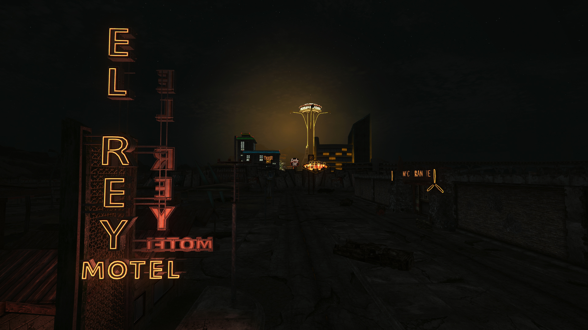

# NEW VEGAS S#ARP – A Fallout: New Vegas Modlist

Last updated: September 24th, 2022.

## Contact

- Nexus Mods: [**Lucas9**](https://www.nexusmods.com/morrowind/users/14600469)
- Reddit: [**Sigourn**](https://www.reddit.com/user/Sigourn)
- RPG Codex: [**Sigourn**](https://rpgcodex.net/forums/index.php?members/sigourn.21476/)

## About

**New Vegas Sharp** is a modular modlist for Fallout: New Vegas. It addresses a number of significant issues with the game:

- Bugs and stability: includes all major bug fixes released for the game so far, with an emphasis on squashing the most noticeable bugs.
- User interface: improved functionality and expanded hotkeys.
- Visuals: vanilla-friendly NPC and lighting improvements.
- Gameplay: basic quality of life improvements and rebalanced gameplay based around **SawyerBatty**, trying to adhere closely to the developer's intention.
- DLCs: reworked implementation, expansions delayed.

Because this modlist is offered "as is" and to be considered complete, I won't be answering compatibility questions.

[**Click here to get started.**](setup.md)

## My setup

System | My Specs
------------ | -------------
Operative System | Windows 8.1 Pro 64-bit
CPU | Intel Core i5 4440
RAM | 8GB
Graphics | 1GB ATI AMD Radeon HD 7700 Series
HDD | 1TB
Monitor | Samsung 24" 1080p @ 60Hz

## Frequently asked questions

### How much space do I need to install these mods?

Roughly 3.5GB.

### Why SawyerBatty FNV?

At the moment, there are two alternatives to Josh Sawyer's [**jsawyer**](https://fallout.fandom.com/wiki/JSawyer) mod.

- The most popular, by far, is PushTheWinButton's [**JSawyer Ultimate Edition**](https://www.nexusmods.com/newvegas/mods/61592?). It is the author's own take on Josh Sawyer's mod, attempting to address inconsistencies and expand the scope of the mod.
- The newest, least popular but more purist-friendly, is RoyBatty's [**SawyerBatty FNV**](https://www.nexusmods.com/newvegas/mods/76436). It is, for all intents and purposes, the "true" ultimate edition of **jsawyer**, as it addresses bugs and inconsistencies, and makes several improvements to the implementation of a number of edits.

Which one you choose to use is up to you. But to answer the question: I prefer **SawyerBatty FNV** solely because, if the original mod was good enough for Josh Sawyer, then it is good enough for me. That said, both mods are fully supported by the guide thanks to patches.

### What are the major differences between New Vegas Sharp and Viva New Vegas?

It boils down to two differences:

- My guide is more extensive, as I believe anyone looking to mod Bethesda games shouldn't worry about the length of a mod list. If you are willing to install 50 compatible mods, you are probably willing to install a hundred.
- I don't remove mods based on people being unable to read. I'd rather have people learn to read than babysitting them.
